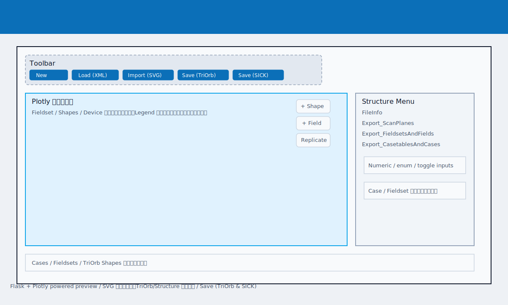

# SICK SLS Editor 利用マニュアル

本書は Web ベースの SICK SLS 監視設定エディタの基本操作をまとめたマニュアルです。Flask/Plotly で動作するアプリをローカル環境で起動し、SafetyDesigner 由来の .sgexml ファイルや SVG 図形を組み合わせてフィールド構成を編集する手順を記載します。

## 動作環境と起動
- Python 3.11 以降を推奨します。`pip install -r requirements.txt` で依存関係を導入します。
- Playwright を利用する場合は `python -m playwright install chromium` を一度実行してください。
- アプリの起動はリポジトリ直下で `python main.py` を実行し、ブラウザから http://127.0.0.1:5000/ にアクセスします。【F:README.md†L6-L18】【F:README.md†L42-L55】

## 画面構成
- ヘッダー右下にツールバーがあり、新規作成、TriOrb 形式保存、SICK 形式保存、XML ロード、SVG インポート、凡例表示切替を行います。【F:templates/index.html†L1806-L1822】
- 中央の Plotly エリアでは Fieldset/Shape・Device 扇形が色分け表示され、右上のオーバーレイボタンから「+ Shape」「+ Field」「Replicate」モーダルを開けます。【F:templates/index.html†L1823-L1837】
- 右側の Structure Menu では FileInfo や Export_ScanPlanes など XML ツリーを展開し、チェックボックス・トグル・数値入力で値を編集できます。【F:templates/index.html†L1850-L1859】
- 下部には Case / Fieldset / TriOrb Shape それぞれの表示切替チェックボックスがあり、プレビュー対象を素早く絞り込めます。【F:templates/index.html†L1838-L1849】

## 基本操作
1. **新規作成 / 読み込み**: ツールバーで「New」を押すと空データで開始します。「Load (XML)」から .sgexml を読み込むとメニューや Plotly 表示が初期化されます。【F:templates/index.html†L1806-L1813】
2. **SVG インポート**: 「Import (SVG)」で円・四角・ポリゴンを含む SVG を取り込み、TriOrb Shapes として追加します。ページ左上が原点となり、読み込んだ図形は Shape ツリーに名前付きで表示されます。未対応要素は無視され、パスは多角形として分割されます。【F:static/js/app.js†L7608-L7699】【F:static/js/app.js†L11726-L11758】
3. **Shape の追加・編集**: Plotly 上の「+ Shape」または Shape 名クリックでモーダルを開き、円・矩形・ポリゴンの種類、カラースタイル、回転や頂点座標を編集します。TriOrb 側の更新は Fieldset 側にも自動反映されます。【F:static/js/app.js†L5052-L5183】【F:README.md†L22-L33】
4. **Fieldset の作成**: 「+ Field」で Fieldset 名や Latin9 Key を自動生成しつつ、Protective/Warning それぞれに Type=Field/CutOut の Shape を割り当てます。Plotly で赤・オレンジ・黒のプレビューを確認し、OK で保存できます。【F:README.md†L93-L101】【F:static/js/app.js†L2675-L2846】
5. **複製 (Replicate)**: Plotly 右上の「Replicate」で選択した Fieldset や Case をオフセット・回転・スケール付きでまとめて複製し、必要に応じて CutOut も含めます。入力変更時には青いプレビューが表示されます。【F:templates/index.html†L1760-L1791】
6. **保存**: 「Save (TriOrb)」は TriOrb メタ情報を含む形式で、複数 Device を `{DeviceName}_` プレフィクス付きファイルとして分割保存します。「Save (SICK)」は SafetyDesigner 互換の旧形式を出力します。【F:README.md†L56-L76】

## Structure Menu 操作のポイント
- 数値欄は数値入力のみを受け付け、true/false はチェックボックス、4 個以下の列挙は横並びトグルで表示されます。【F:Agent.md†L33-L41】【F:static/js/app.js†L77-L138】
- Export_FieldsetsAndFields の Device / Fieldset / Field をツリー表示し、TriOrb で管理する Shape ID を参照します。MultipleSampling や Tolerance± などは TriOrb 側の同期パラメータが反映されます。【F:Agent.md†L4-L21】【F:README.md†L15-L33】
- Export_CasetablesAndCases では Case の追加・削除や StaticInputs/SafetyRange 入力、Eval ごとの UserFieldId 割り当てが可能で、ケース数は最大 128 件まで拡張できます。【F:Agent.md†L45-L78】【F:main.py†L88-L139】

## 図形プレビューとカラースキーム
- Field/CutOut/TriOrb の種別ごとに HSVA ベースの色が自動適用され、Legend ボタンで Plotly の凡例を隠す/表示することで視認性を切り替えられます。【F:README.md†L27-L40】【F:templates/index.html†L1818-L1822】
- Device 扇形は常に最背面に描画され、Shape をクリックするとモーダルで編集できます。キャンセル時は元の値に戻り、削除ボタンは編集モードのみ表示されます。【F:Agent.md†L11-L21】【F:templates/index.html†L1823-L1837】

## 手順例（ユーザー提供のアペンディックス）
1. CAD 図面などから AMR 輪郭および CutOut マスクの SVG を等倍で作成する（原点はページ左上、円・四角・ポリゴンのみ有効）。曲線は頂点を増やして近似する。編集ツールは Inkscape を推奨。
2. 本 Web アプリを開き、SafetyDesigner からエクスポートしたレーザースキャナの監視設定ファイル (.sgxml) を Load するか、新規作成を押す。
3. SVG インポートボタンから手順 1 のファイルを読み込む。
4. ページ下部の Shape として輪郭やマスクが取り込まれる（Shape ツリーで名前変更すると管理しやすい）。
5. 「+ Field」ボタンから Body などの Field を作成し、取り込んだ Shape をアタッチする。
6. 「Replicate」ボタンから Body Field を拡大複製し、停止中の最小防護フィールドを作成する。必要なら SVG 作成時に最小防護フィールドも用意しておく。

## 参考スクリーンショット

テキストベースの SVG でレイアウトを示しているため、PR 作成時にバイナリ差分でブロックされず、UI 構造だけを簡潔に確認できます。

以上で、TriOrb 連携を含む SICK SLS Editor の主要な使い方を網羅しています。入力値の変更後は Plotly 表示や Structure Menu の整合性を確認し、必要に応じて Playwright テストや手動チェックを行ってください。【F:Agent.md†L22-L32】
